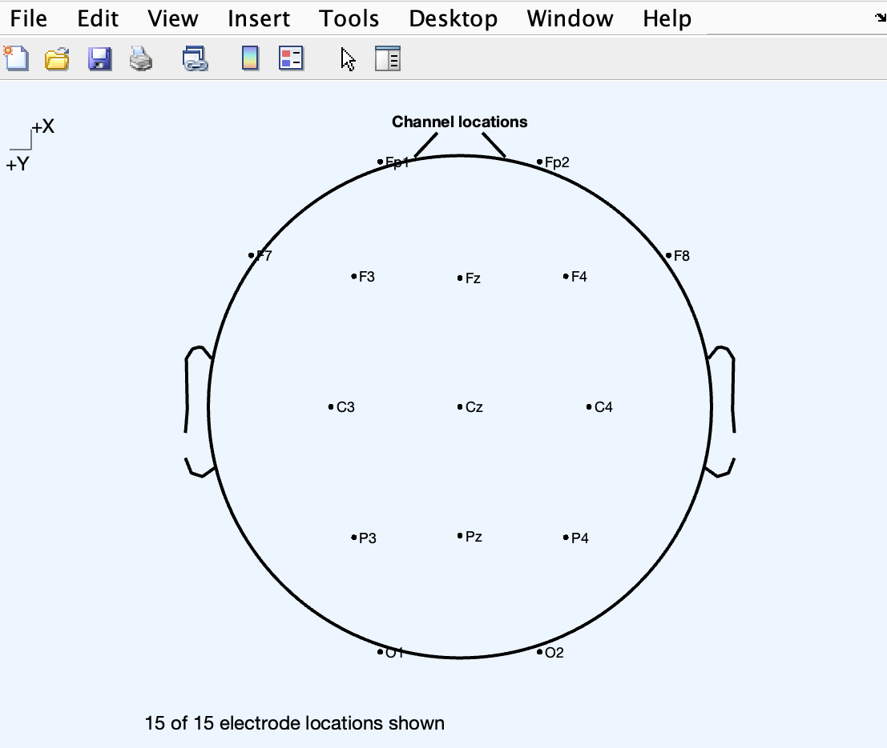
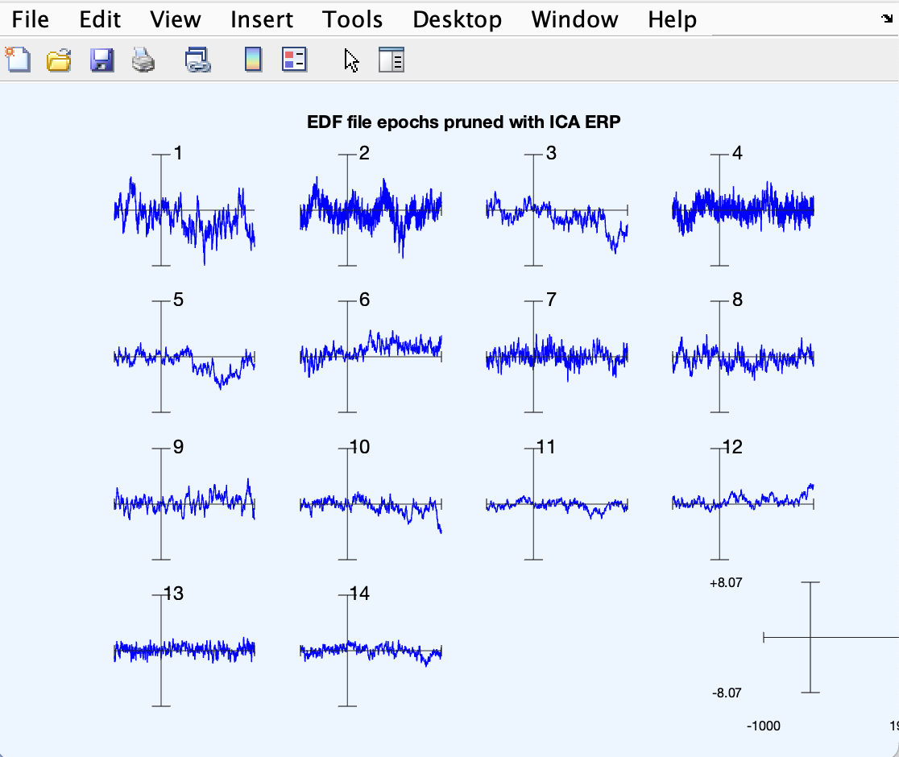

## 1. Run **eeglab** from MATLAB Command Window

> Collect data files → convert files to CSV → convert CSV files to EDF

 

## 2. **Opening an existing dataset:**

> File → Import Data → Using EEGLAB functions and plugins → From EDF Files

 

## 3. **Editing Event Fields:**

> File → Import event info → From MATLAB array or ASCII file

 

## 4. **Edit → Channel locations**

 

## 5. **Plotting Channel Spectra and Maps:**

 

## 6. **Extracting data epochs:**

> Tools → Extract epochs

 

## 7. **Plotting the ERP data on a single axis with scalp maps:**

> Plot → Channel ERP Image

 

## 8. **Plotting ERP traces in a topographic array:**

> Plot → Channel ERPs → In scalp/rect. Array

 

**Plot in rectangular array**

 

## 9. **Plotting an ERP as a series of maps:**

> Plot → ERP Map Series → In 2D

 

> Plot → ERP Map Series → In 3D

 

## 10. **Plotting ERP images using pop_erpimage():**

> Plot → Channel ERP image

 

## 11. **Sorting trials in ERP images:**

Too few trials.

 

## 12. **Running ICA decompositions:**

> Tools → Decompose data by ICA

 

## 13. **Plotting 2−D Component Scalp Maps:**

> Plot → Component Maps → In 2D

 

> Plot → Component activations (scroll)

 

## 14. **Plotting component headplots:**

> Plot → Component maps → In 3D

 

## 15. **Studying and removing ICA components:**

> Tools → Remove components from data

 

> Plot → Component activations (scroll)

 

> Plot → Component properties

 

**Channel data (scroll)**

 

## 16. **Plotting component spectra and maps:**

> Plot → Component spectra and maps

 

## 17. **Plotting component ERPs:**

> Plot → Component ERPs → In rectangular array

 

## 18. **Time/Frequency Decomposition, Decomposing channel data:**

> Plot → Component time-frequency

